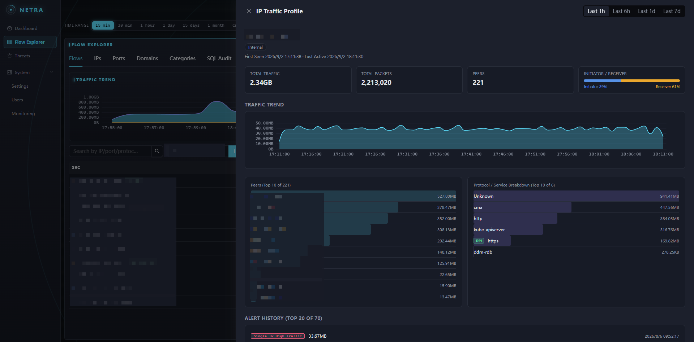
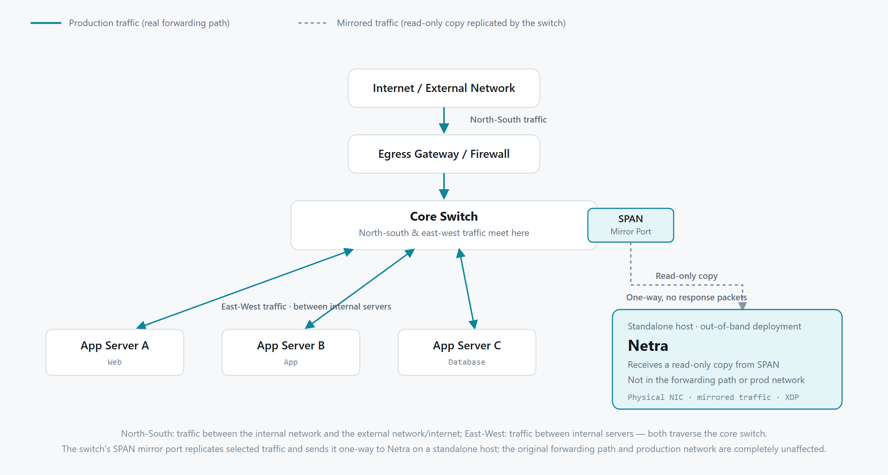
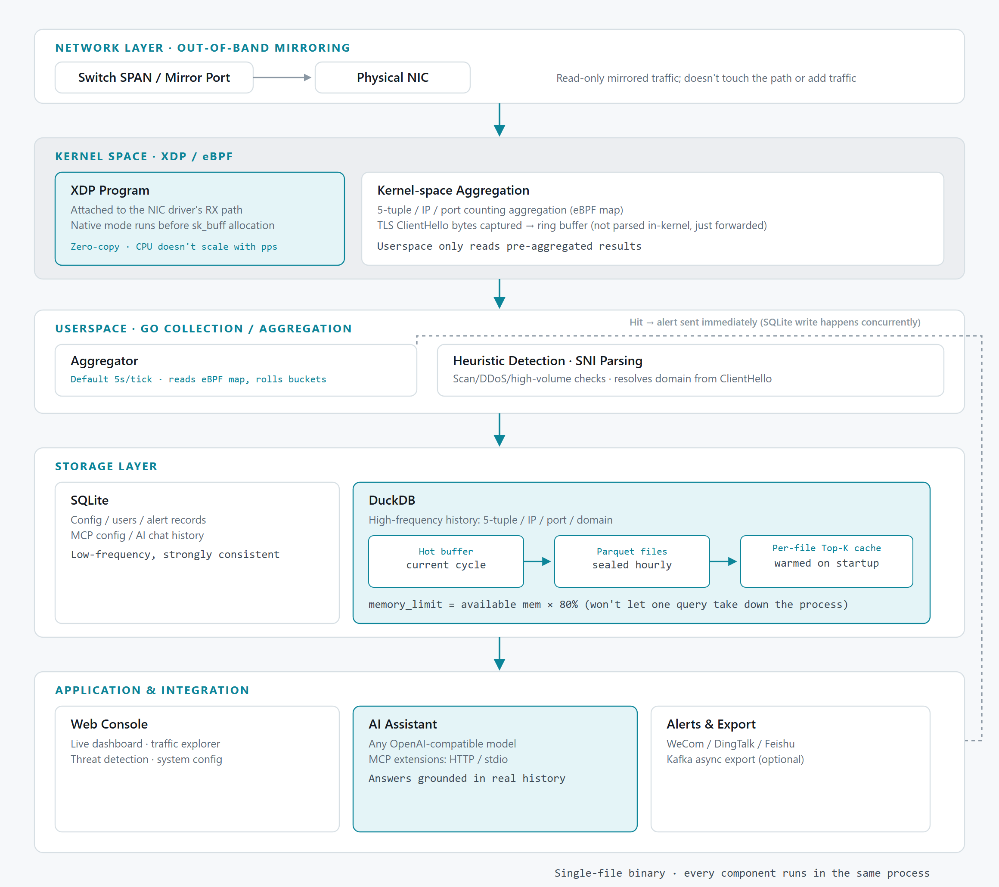
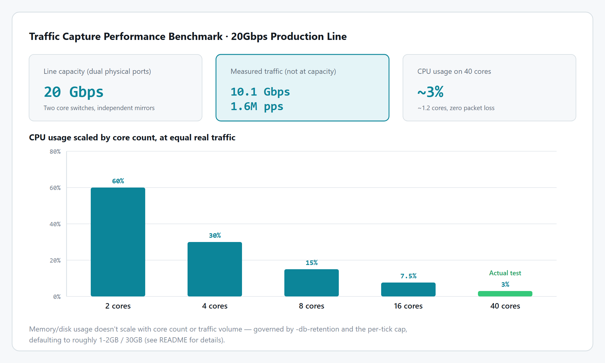
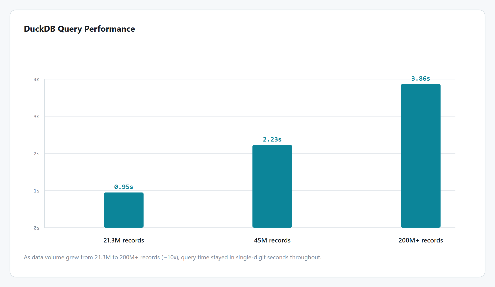

<h2 align="center">Netra</h2>

<p align="center">
  <a href="https://github.com/xxddpac/netra/actions/workflows/build.yml"></a>
  
  
  
  
  
</p>

<p align="center">One binary. Lightweight, high-performance. Observe your network with eBPF. Ask AI. Extend with MCP</p>

<p align="center">🌍 English · <a href="README.zh-CN.md">简体中文</a></p>

## Introduction

Netra is a traffic visibility platform deployed out-of-band on a mirrored NIC — it never sits in the path of production traffic. Ships as a single binary.

## Screenshots

<p align="center"><sub>Dashboard</sub></p>


<p align="center"><sub>IP Traffic Profile</sub></p>


## Architecture

Netra doesn't generate any traffic of its own, and it never sits on a forwarding path — what it receives is a read-only copy replicated by the switch's SPAN/mirror port:



Once that copy reaches Netra, here's the processing pipeline (kernel-space XDP/eBPF → userspace collection → storage → application layer):



## Traffic Capture Performance

Traditional packet capture (libpcap, tcpdump, AF_PACKET, etc.) copies every packet to userspace before parsing it there — overhead scales linearly with packet rate, and once userspace processing can't keep up under heavy traffic, packets get dropped. Netra attaches its XDP program to the NIC driver's receive path, and in native mode runs even before the kernel allocates an `sk_buff` — capture, parsing, and aggregation all stay in kernel space, with userspace only reading already-aggregated results. CPU overhead doesn't scale linearly with packet rate.



<sub>The numbers above come from a production measurement across two 10Gbps physical NICs (roughly 20Gbps combined). If your deployment runs at larger scale, feel free to share Netra's performance numbers in [Issues](https://github.com/xxddpac/netra/issues).</sub>

## Storage & Query Performance

Traffic history (5-tuples/IPs/ports/domains) is sealed into hourly Parquet files, and queries are handed off to DuckDB's columnar engine for aggregation — compared to bringing in an external time-series store like ClickHouse, DuckDB is embedded in the same binary and needs no extra deployment or operations.

But the 5-tuple dimension has cardinality that's naturally close to the raw row count (source ports rarely repeat), so this went through several rounds of benchmarking and optimization: queries cache Top-K results per sealed file, covering any custom time range; on startup, the cache for existing historical files is warmed concurrently in the background; and each DuckDB connection's `memory_limit` is set dynamically based on available memory, so an aggregation query under extreme data volume can't take down the whole process.



## Features

- **Live Dashboard**: total traffic, protocol breakdown, traffic trends, top IP/port/domain rankings, destination country distribution, world map, internal topology graph.
- **Traffic Explorer**: multi-dimensional views by flow, IP, port, domain, and service category; each 5-tuple row is tagged with an initiator/receiver icon (based on the TCP handshake's SYN/ACK direction).
- **IP Traffic Profile**: enter an IP on the flow page to pop open a profile panel — total traffic/packets, peer ranking, protocol/service breakdown, initiator/receiver traffic share, trend chart, and alert history for that IP.
- **Threat Detection**: four heuristic detectors — port/host scanning, DDoS, single-IP high volume, and IOC hits (single entry or bulk xlsx import) — can push to WeCom/DingTalk/Feishu, with AI-generated analysis attached when enabled.
- **Weak Credential Detection**: parses credentials out of plaintext HTTP login requests (Basic Auth / form / JSON) and flags matches against a weak-password dictionary or structural rules (too short, all-digits, all-lowercase, same as username, etc). Passwords are encrypted at rest (AES-GCM) and only decrypted on demand for admins. Covers plaintext HTTP only — encrypted TLS traffic can't be parsed.
- **Domain Resolution**: passively parses SNI from TLS traffic and the Host header from plaintext HTTP — neither depends on port number, so services running on non-standard ports still get their domain resolved.
- **Service Identification**: services are identified by default against a built-in IANA port registry; TLS/SSH/FTP/SMTP/POP3/IMAP/MySQL/PostgreSQL/MongoDB/Redis/RDP/VNC/AMQP/gRPC additionally get content-based identification (DPI) that doesn't depend on port number, so services on non-standard ports are still recognized and tagged as DPI.
- **SQL Audit**: for connections DPI has identified as MySQL/MongoDB, captures the client's query text and persists it, searchable by IP or query content. TLS-encrypted database connections can't be captured.
- **GeoIP Enrichment**: integrates MaxMind GeoLite2 to tag public IPs with country and owning organization.
- **Persistence**: hybrid SQLite + DuckDB storage — low-frequency data (config/users/alerts) goes to SQLite, high-frequency traffic history (IP/port/domain/5-tuple) goes to DuckDB, sealed into Parquet files on a rolling schedule.
- **AI Assistant**: connects to any OpenAI-protocol-compatible model, answers questions grounded in real historical data.
- **MCP Extensions**: connect MCP servers (e.g. an internal CMDB, threat intel tools) that the AI assistant can call on demand during a conversation; supports both HTTP and stdio transports, plus Basic/Bearer auth.
- **Kafka**: if you'd rather build your own visualization in Grafana or similar instead of using Netra's built-in dashboard, enable this — flow details get pushed to Kafka asynchronously for any downstream consumer.

  <details>
  <summary>Example Kafka payload</summary>

  ```json
  {
    "timestamp": "2026-08-27T15:04:05.123456+08:00",
    "srcIP": "10.20.1.16",
    "srcPort": 51422,
    "srcLabel": "EHR",
    "srcCountry": "CN",
    "dstIP": "203.0.113.20",
    "dstPort": 443,
    "dstLabel": "Partner VPN",
    "dstCountry": "US",
    "proto": "tcp",
    "service": "https",
    "dpi": true,
    "svcOnSrc": false,
    "domain": "example.com",
    "packets": 42,
    "bytes": 5210
  }
  ```

  `srcLabel`/`srcCountry`/`dstLabel`/`dstCountry`/`service`/`dpi`/`svcOnSrc`/`domain` are all `omitempty`: they only show up in the JSON when actually identified/matched (e.g. no `srcLabel` if the internal IP has no asset tag configured, no `domain` if none was resolved — TLS via SNI, plaintext HTTP via the Host header). No empty strings or `false` placeholders are emitted.

  `svcOnSrc` being `true` means this record is in the server-to-client reply direction.

  </details>

## Deployment

### Requirements

- Linux kernel, 4.18+ recommended (`uname -r`) — newer versions generally have better native XDP driver support.
- Whether native XDP is available depends on kernel version, NIC driver, and available hardware RX/TX queue headroom — all three matter. How to check:
  1. `ethtool -i <iface>` to see the NIC driver (e.g. ixgbe, i40e, mlx5, virtio_net) — mainstream drivers mostly support native XDP, but behavior varies by driver;
  2. Start Netra without `-generic` first, then check with `ip link show <iface>` — output containing `prog/xdp id ...` means native mode attached successfully; `prog/xdpgeneric id ...`, or an attach-failure error in the startup log, means it fell back to generic mode;
  3. In testing we've seen cases where the driver itself supports native XDP but the hardware RX/TX queues were already fully allocated, causing attach to fail (e.g. ixgbe) — in that case generic mode is the only option even though both kernel and driver are otherwise fine.
- **The runtime environment needs glibc >= 2.28** (`ldd --version`) — DuckDB/CGO bring in a dynamic-linking dependency.

### Flags

| Flag              | Required | Default        | Description                                |
|-----------------|-----|------------|-----------------------------------|
| `-iface`        | Yes  | -          | NIC(s) to attach the XDP program to; comma-separate for multiple (e.g. `eno1,eno2`) — they share the same eBPF map and the aggregated view merges automatically |
| `-web-addr`     | No   | `:10211`   | Web dashboard listen address        |
| `-generic`      | No   | false      | Force generic/SKB mode when enabled |
| `-interval`     | No   | 5s         | Collection interval — how often the eBPF map is read and a stat bucket rolled over |
| `-geoip-db`     | No   | `GeoLite2-City.mmdb` (current dir) | Used for the dashboard's world map. |
| `-geoip-asn-db` | No   | `GeoLite2-ASN.mmdb` (current dir)  | Used to tag public IPs with organization info. |
| `-db`           | No   | `netra.db` (current dir) | DB file path, used for persistence |
| `-db-retention` | No   | `1m` (1 month) | How long historical data is kept, formatted as `<N>d` (days) or `<N>m` (months) |
| `-db-hot-period` | No   | 1h         | How often traffic history is sealed from the in-memory hot buffer into a file |

Both GeoIP `.mmdb` files need to be obtained separately — register an account at the [MaxMind site](https://www.maxmind.com/en/geolite2/signup) and download them, or grab them without registration from the third-party mirror [P3TERX/GeoLite.mmdb](https://github.com/P3TERX/GeoLite.mmdb). Drop them next to the `netra` binary and they're picked up automatically, no flags needed; only use `-geoip-db`/`-geoip-asn-db` with an absolute path if you keep them elsewhere.

### Running under systemd

1. Get the latest `netra` binary from the [Releases](https://github.com/xxddpac/netra/releases) page. Create a working directory and put the `netra` binary plus both GeoIP `.mmdb` files in it:

   ```ini
   mkdir -p /opt/netra
   cp netra GeoLite2-City.mmdb GeoLite2-ASN.mmdb /opt/netra/
   chmod +x /opt/netra/netra
   ```

2. Save the following as `/etc/systemd/system/netra.service` (swap the NIC name after `-iface` for your real interface):

   ```ini
   [Unit]
   Description=One binary. Lightweight, high-performance. Observe your network with eBPF. Ask AI. Extend with MCP.
   After=network.target

   [Service]
   Type=simple
   WorkingDirectory=/opt/netra
   ExecStart=/opt/netra/netra -iface ens7f1 
   User=root
   StandardOutput=journal
   StandardError=journal
   SyslogIdentifier=netra
   Restart=on-failure
   RestartSec=10

   [Install]
   WantedBy=multi-user.target
   ```

3. Load and start it:

   ```ini
   systemctl daemon-reload
   systemctl start netra
   systemctl status netra
   journalctl -u netra -f
   ```

**On first startup**, a randomly generated admin username/password is printed to the log — log in and change it.

## Building

The local build environment is fairly involved: Netra only runs on Linux (XDP is a Linux kernel feature), and the traffic-history storage engine (DuckDB) depends on CGO, so it has to be compiled natively with a Linux + C toolchain, with a matching glibc version.

```ini
cd frontend
npm install
npm run build
cd ..
CGO_ENABLED=1 GOOS=linux GOARCH=amd64 go build -o netra .
```

If you want to add a feature or fix a bug, you don't need to set up this build environment locally — follow these steps instead:

1. Fork this repo. The first time you open your fork's Actions tab you may see a "Workflows aren't being run on this forked repository" notice — just click to confirm.
2. Clone your fork locally:
   ```ini
   git clone git@github.com:<your-username>/netra.git
   cd netra
   ```
3. Create a branch: `git checkout -b fixbug`
4. Make your changes
5. Commit and push:
   ```ini
   git add .
   git commit -m 'fix: xxx'
   git push origin fixbug
   ```
   This automatically triggers CI to build it.
6. Once the build finishes, download `netra-linux-amd64` from the Artifacts of that Build run, deploy and verify it works, then open a Pull Request.

The first triggered build takes a while (DuckDB gets downloaded and compiled from source); later builds hit the Docker layer cache and are much faster.
