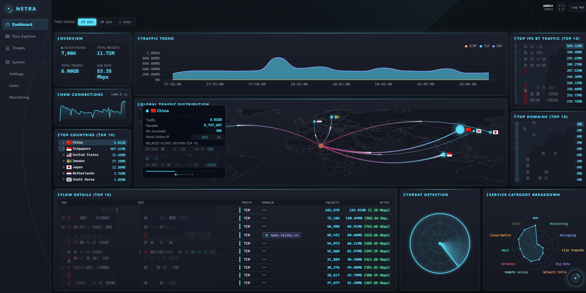
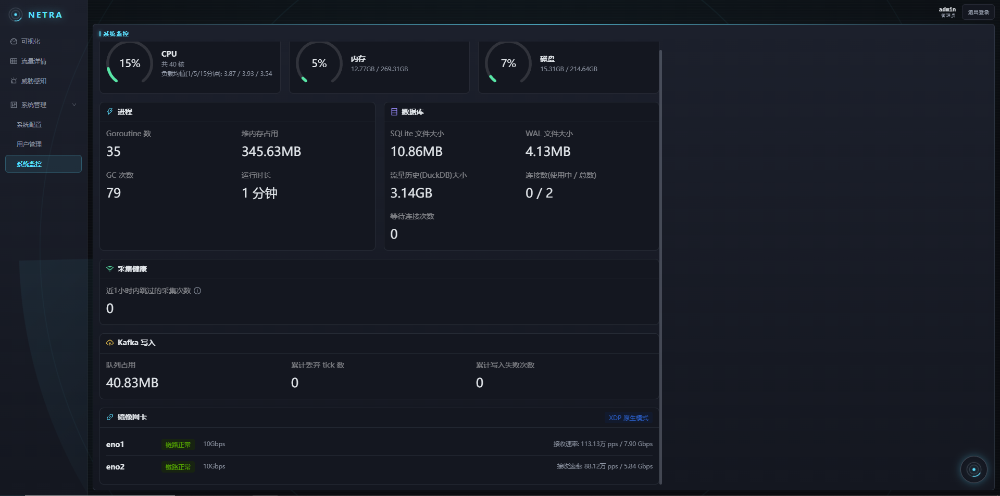
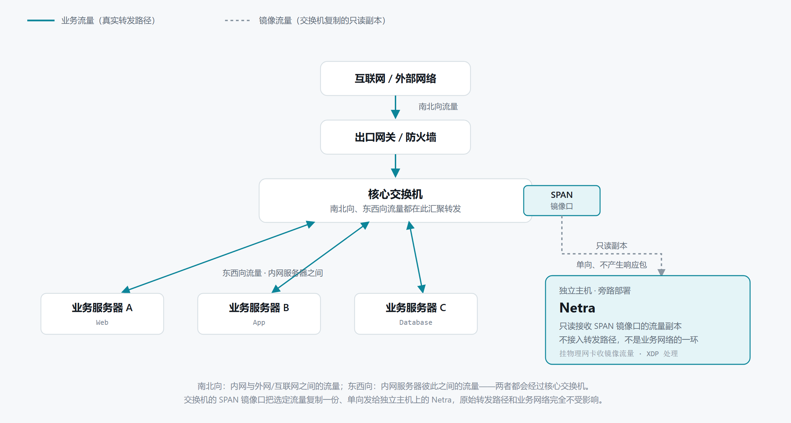
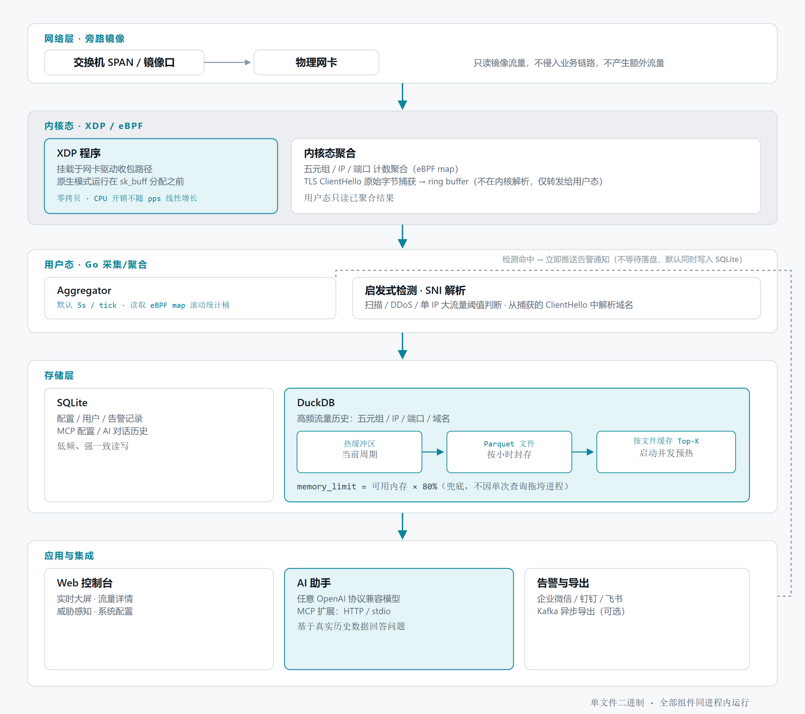
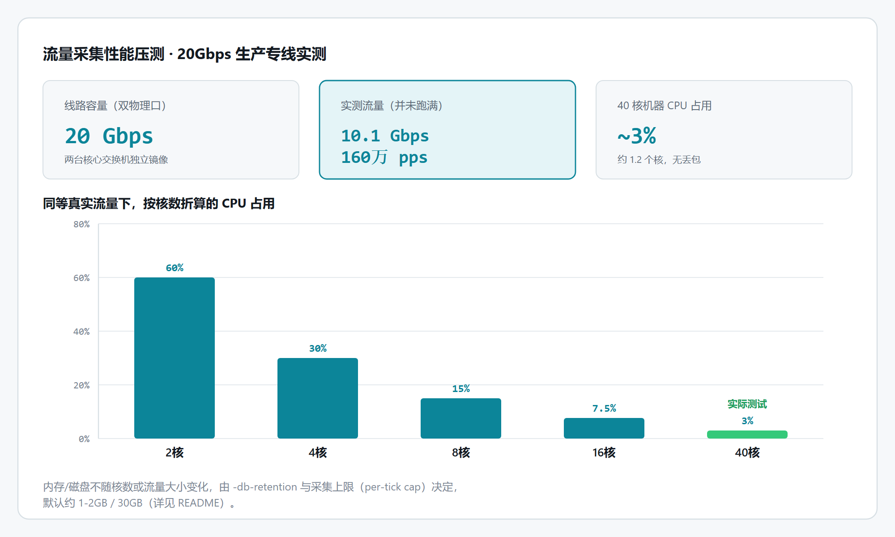
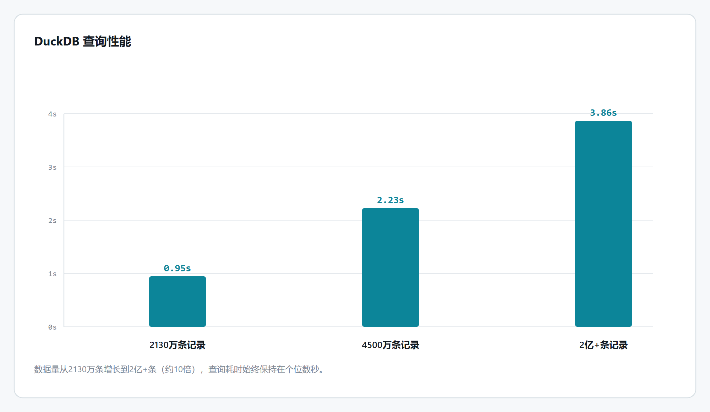

<h2 align="center">Netra</h2>

<p align="center">
  <a href="https://github.com/xxddpac/netra/actions/workflows/build.yml"></a>
  
  
  
  
  
</p>

<p align="center">One binary. Lightweight, high-performance. Observe your network with eBPF. Ask AI. Extend with MCP</p>

## 介绍

Netra 是一个旁路部署在镜像网卡的流量可视化平台，不侵入业务链路。单文件二进制即可运行。

## Demo演示



https://github.com/user-attachments/assets/7be16b4e-27a3-46bc-b485-7bfea1c40b95

除了业务流量，Netra 自身的运行状态（CPU/内存/数据库/Kafka 写入/镜像网卡链路等）也可以在系统监控页面实时查看



## 整体架构

Netra 自己不产生流量，也不挂在业务转发路径上——它接的是交换机 SPAN 镜像口复制出来的一份只读副本：



这份副本进入 Netra 之后的处理链路（内核态 XDP/eBPF → 用户态采集 → 存储 → 应用层）如下：



## 流量采集性能

传统抓包（libpcap、tcpdump、AF_PACKET 等）每个包都要拷贝到用户态再逐包解析，开销随包速率线性增长，大流量场景下一旦用户态处理跟不上就会丢包。Netra 把 XDP 程序挂在网卡驱动的收包路径上，原生模式下甚至运行在内核分配 `sk_buff` 之前——采集、解包、统计全程留在内核态，用户态只读取已经聚合好的结果，CPU 开销不随包速率线性增长。



<sub>以上数据来自两块 10Gbps 物理网卡（合计约 20Gbps 带宽）的生产环境实测。如果你的部署流量规模更大，欢迎在 [Issues](https://github.com/xxddpac/netra/issues) 里反馈 Netra 的性能表现。</sub>

## 存储查询性能

流量历史（五元组/IP/端口/域名）按小时封存为 Parquet 文件，查询时交给 DuckDB 的列式引擎做聚合——相比引入如 ClickHouse 这类外部时序存储，DuckDB 内嵌在同一个二进制里，不需要额外部署运维。

但五元组这个维度基数天然接近原始行数（源端口很少重复），为此做了几次压测和优化：查询时按封存文件缓存 Top-K 结果，覆盖任意自定义时间范围；服务启动时后台并发预热已有历史文件的缓存；DuckDB 连接按可用内存动态设置了 `memory_limit`，避免极端数据量下的聚合查询把整个进程拖垮。



## 支持的功能

- **实时大屏**：总流量、协议占比、流量趋势、Top IP/端口/域名排名、目标国家分布、世界地图、内网拓扑图。
- **流量详情**：按流量、IP、端口、域名、服务分类等多维度数据。
- **威胁感知**：扫描/DDoS/单 IP 大流量三类启发式检测，命中可推送到企业微信/钉钉/飞书，启用 AI 后附带自然语言解读。
- **域名识别**：被动解析 TLS SNI。
- **GeoIP 富化**：接入 MaxMind GeoLite2，标注公网 IP 的国家与归属组织。
- **持久化**：SQLite + DuckDB 混合存储——低频的配置/用户/告警等数据走 SQLite，高频的流量历史（IP/端口/域名/五元组）走 DuckDB，按时间片滚动存为 Parquet 文件。
- **AI 助手**：可接入任意 OpenAI 协议兼容模型，基于真实历史数据回答问题。
- **MCP 扩展**：可接入外部 MCP Server，AI 助手对话时可按需调用其提供的工具，支持 HTTP/stdio 两种传输方式及 Basic/Bearer 认证。
- **Kafka**：如果想用 Grafana 等工具自己做可视化，而不是用 Netra 自带的 Dashboard，可以启用这个功能——流量明细会异步推送到 Kafka，自由对接下游系统消费使用。

## 部署

### 环境要求

- Linux 内核，建议 4.18 及以上（`uname -r`）；版本越新，原生 XDP 的驱动兼容性通常越好。
- 是否可以用原生 XDP，取决于内核版本、网卡驱动、硬件收发队列余量，三者缺一不可，判断步骤：
  1. `ethtool -i <iface>` 查看网卡驱动（如 ixgbe、i40e、mlx5、virtio_net 等），主流驱动大多支持原生 XDP，但具体表现因驱动而异；
  2. 启动 Netra 时先不加 `-generic`，跑起来后用 `ip link show <iface>` 看结果——输出里带 `prog/xdp id ...` 说明原生模式挂载成功；带 `prog/xdpgeneric id ...`，或启动日志里有挂载失败的报错，需要回退到了通用模式；
  3. 在测试中遇到过网卡驱动本身支持原生 XDP、但硬件收发队列已经被占满导致挂载失败的情况（如 ixgbe），这种即便内核和驱动都没问题，也只能用通用模式。
- **运行环境需要 glibc >= 2.28**（`ldd --version`）—— DuckDB/CGO 引入动态链接依赖。

### 启动参数

| 参数              | 必填  | 默认值        | 说明                                |
|-----------------|-----|------------|-----------------------------------|
| `-iface`        | 是   | -          | 要挂载 XDP 程序的网卡名，多网卡用逗号分隔（如 `eno1,eno2`），共享同一份 eBPF map，聚合视图自动合并 |
| `-web-addr`     | 否   | `:10211`   | WEB监听地址                           |
| `-generic`      | 否   | false      | 开启后强制使用通用/SKB 模式                  |
| `-interval`     | 否   | 5s         | 采集周期，多久读取一次 eBPF map 并滚动一次统计桶     |
| `-geoip-db`     | 否   | `GeoLite2-City.mmdb`（当前目录） | 用于dashboard世界地图。                  |
| `-geoip-asn-db` | 否   | `GeoLite2-ASN.mmdb`（当前目录）  | 用于标记公网IP的组织信息。                    |
| `-db`           | 否   | `netra.db`（当前目录） | DB文件路径，用于持久化                      |
| `-db-retention` | 否   | `1m`（1 个月） | 历史数据保留时长，格式为 `<N>d`（天）或 `<N>m`（月） |
| `-db-hot-period` | 否   | 1h         | 流量历史从内存热缓冲封存为文件的周期                |

GeoIP 的两个 `.mmdb` 文件 需自行获取，[MaxMind 官网](https://www.maxmind.com/en/geolite2/signup)注册账号下载或第三方镜像仓库 [P3TERX/GeoLite.mmdb](https://github.com/P3TERX/GeoLite.mmdb) 免注册下载，放到 netra 二进制同目录下即可自动识别，不需要显式传参；放在别的位置才需要用 `-geoip-db`/`-geoip-asn-db` 指定绝对路径。

### systemd 常驻运行

1. 获取 `netra` 二进制——从 [Releases](https://github.com/xxddpac/netra/releases) 页面下载。创建工作目录，把 `netra` 二进制和 `GeoIP` 的两个 `.mmdb` 文件都放进去

   ```ini
   mkdir -p /opt/netra
   cp netra GeoLite2-City.mmdb GeoLite2-ASN.mmdb /opt/netra/
   chmod +x /opt/netra/netra
   ```

2. 把下面内容保存为 `/etc/systemd/system/netra.service` ( `-iface` 后面的网卡换成实际网卡名 )

   ```ini
   [Unit]
   Description=One binary. Lightweight, high-performance. Observe your network with eBPF. Ask AI. Extend with MCP.
   After=network.target

   [Service]
   Type=simple
   WorkingDirectory=/opt/netra
   ExecStart=/opt/netra/netra -iface ens7f1 
   User=root
   StandardOutput=journal
   StandardError=journal
   SyslogIdentifier=netra
   Restart=on-failure
   RestartSec=10

   [Install]
   WantedBy=multi-user.target
   ```

3. 加载并启动：

   ```ini
   systemctl daemon-reload
   systemctl start netra
   systemctl status netra
   journalctl -u netra -f
   ```

**首次启动** 会在日志里打印随机生成的管理员admin账号密码，登录系统后自行修改。

## 编译

本地编译环境较复杂，Netra 只能运行在 Linux 上（XDP 是 Linux 内核特性），流量历史存储引擎（DuckDB）又依赖 CGO，必须用 Linux + C 工具链原生编译，而且 glibc 版本要匹配。

```ini
cd frontend
npm install
npm run build
cd ..
CGO_ENABLED=1 GOOS=linux GOARCH=amd64 go build -o netra .
```

如果你想新增功能或发现 bug，不需要在本地搭这套编译环境，可以按照以下步骤：

1. Fork 本仓库，首次进 fork 的 Actions 标签页可能会看到 "Workflows aren't being run on this forked repository" 提示，点一下确认即可。
2. Clone 自己的 fork 到本地：
   ```ini
   git clone git@github.com:<你的用户名>/netra.git
   cd netra
   ```
3. 切换分支：`git checkout -b fixbug`
4. 修改代码
5. 提交并 push 到分支：
   ```ini
   git add .
   git commit -m 'fix: xxx'
   git push origin fixbug
   ```
   这一步会自动触发 CI 进行编译
6. 编译完成后，在对应的 Build 记录里的 Artifacts 下载 `netra-linux-amd64`，部署测试验证，确认没问题再发起 Pull Request。

<sub>如果这个项目对你有帮助，可以[请作者喝杯咖啡](docs/sponsor.jpg) ☕。</sub>
