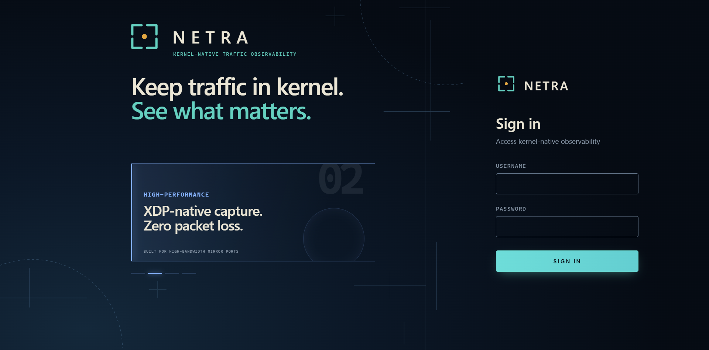
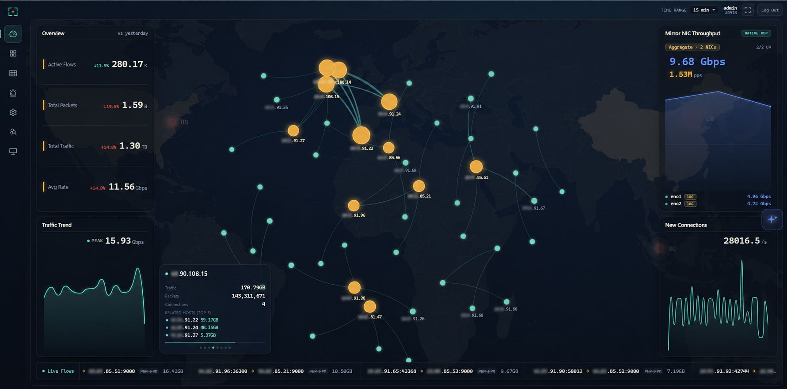
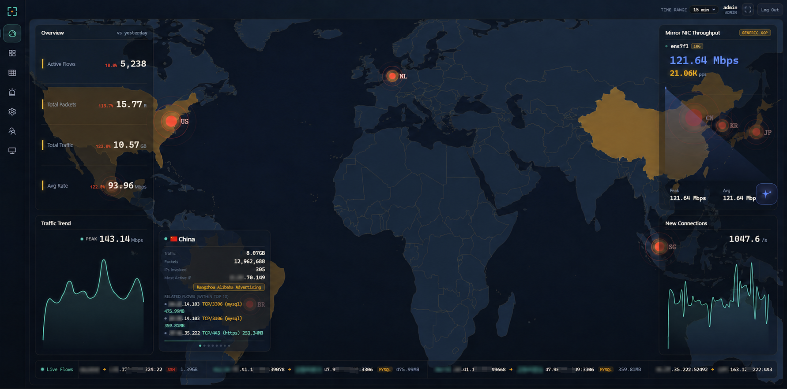

<h2 align="center">Netra</h2>

<p align="center">
  <a href="https://github.com/xxddpac/netra/actions/workflows/build.yml"></a>
  
  
  
  
  
</p>

<p align="center"><b>One binary. Zero dependencies.</b><br />XDP-native capture. Kernel-space aggregation.<br />Ask AI. Extend with MCP.</p>

<p align="center"><a href="README.md">English</a></p>

Netra 是一款面向 SPAN/镜像口的内核原生流量可观测平台。它读取网络流量的旁路副本，不介入业务转发路径，也无需运行一整套数据基础设施。

## 为什么选择 Netra

- **轻量部署**——一个二进制内嵌 SQLite 与 DuckDB；无需部署或维护 Redis、ClickHouse、Elasticsearch 等基础组件。
- **专为大流量而生**——XDP 原生采集、内核态聚合，将逐包处理留在用户态之外。
- **只旁路，不转发**——仅读取 SPAN/镜像口的流量副本；不路由、不代理、不改写业务流量。
- **由真实流量驱动的 AI**——使用自然语言查询 Netra 已观测的数据，并通过 MCP 接入自有工具与数据源，例如 CMDB、威胁情报或 SOC 系统。

## 快速开始

1. 从 [Releases](https://github.com/xxddpac/netra/releases) 下载最新 Netra 二进制文件。
2. 将 `GeoLite2-City.mmdb` 与 `GeoLite2-ASN.mmdb` 放在 Netra 同一目录。GeoLite2 数据库可从 [MaxMind](https://www.maxmind.com/en/geolite2/signup) 注册下载，或使用兼容镜像[P3TERX/GeoLite.mmdb](https://github.com/P3TERX/GeoLite.mmdb)。
3. 以 root 身份，或以具备挂载 XDP 程序所需权限的用户启动：

   ```bash
   chmod +x ./netra
   sudo ./netra -iface <mirror-nic>
   # sudo ./netra -iface <mirror-nic> -generic
   ```

3. 打开 `http://<host>:10211`。首次启动时，Netra 会在日志中打印管理员admin随机生成的密码；登录后请及时修改密码。

## 截图



<p align="center"><sub>内网拓扑</sub></p>


<p align="center"><sub>世界地图</sub></p>


## 整体架构

Netra 接收的只是交换机 SPAN/镜像口复制出的流量副本：


处理路径依次为内核态 XDP/eBPF、用户态采集、内嵌存储和应用层：


## 性能

### 流量采集

传统抓包工具需要将每个包复制到用户态后再解析，开销随包速率线性增长；当内核缓冲区溢出或用户态处理能力不足时，便会发生丢包。Netra 将 XDP 挂载在网卡收包路径，抓取、解析与聚合均留在内核态，用户态只读取已聚合的结果。

下图数据来自两张 10Gbps 镜像网卡与一台 40 核生产主机：约 20Gbps / 160 万 pps、零丢包、约 1.2 个 CPU 核。


### 存储与查询

流量历史按小时封存为 Parquet 文件，并预热按文件拆分的 Top-K 缓存。通过 DuckDB 强大的列式查询引擎，无需运行外部时序数据库也能高效完成海量历史数据的聚合查询。


## 功能

### Dashboard

- **实时大屏**——自动刷新概览指标、流量趋势、镜像网卡吞吐、新连接速率、实时流量、目标国家、世界地图和内网拓扑；地图支持世界视图、拓扑视图或自动轮换。
- **洞察总览**——按协议、服务分类、国家、IP、端口、域名、流量趋势和连接速率拆分查看完整的大屏数据。

### 流量与威胁

- **流量探索**——按流、IP、端口、域名、服务分类、SQL 审计和弱口令结果搜索与分页；五元组流量会标出基于 TCP SYN/ACK 推断的发起方/接收方方向。
- **IP 画像**——从支持的 IP 列表打开指定地址，查看流量总量、通信对端、协议与服务构成、趋势、历史告警和服务指纹。
- **威胁告警**——查看端口/主机扫描、疑似 DDoS、单 IP 大流量和 IOC 命中；可配置企业微信、钉钉、飞书通知，并在启用 AI 后补充研判。

### 运维与集成

- **系统设置**——配置刷新与地图轮换、威胁阈值、容量上限、Kafka、SQL 审计、弱口令检测、IOC 观察名单、资产标签、告警渠道和 MCP 服务。
- **系统监控**——查看主机与进程健康度、数据库和流量历史存储、采集跳过次数、Kafka 队列以及镜像网卡/XDP 状态。
- **用户管理**——管理员可管理 Dashboard 账号和会话策略。
- **AI 助手**——通过兼容 OpenAI 协议的模型，用自然语言查询 Netra 已观测的流量。
- **MCP 扩展**——通过 HTTP 或 stdio 调用自有工具和数据源，并支持可选的 Basic/Bearer 认证。
- **Kafka**——异步推送五元组流量记录，供 Grafana 或其他下游消费者使用。
- **被动增强**——提供 GeoIP/ASN、TLS SNI、HTTP Host、IANA 端口映射、协议 DPI 和明文 HTTP 服务指纹。
- **用户管理**——管理员可管理 Dashboard 账号和会话策略。
- **AI 助手**——通过å
¼å®¹ OpenAI 协议的模型，用自然语言查询 Netra 已观测的流量。
- **MCP 扩展**——通过 HTTP 或 stdio 调用自有工å
·å’Œæ•°æ®æºï¼Œå¹¶æ”¯æŒå¯é€‰çš„ Basic/Bearer 认证。
- **Kafka**——异步推送五å
ƒç»„流量记录，供 Grafana 或å
¶ä»–下游消费è€
使用。
- **被动增强**——提供 GeoIP/ASN、TLS SNI、HTTP Host、IANA 端口映射、协议 DPI 和明文 HTTP 服务指纹。

### 环境要求

- `x86_64（amd64）`；推荐 Linux 内核 4.18 及以上。
- DuckDB/CGO 使用动态链接，运行环境需要 glibc >= 2.28（使用 `ldd --version` 检查）。
- 使用原生 XDP 前，可通过 `ethtool -i <iface>` 查看网卡驱动；启动后使用 `ip link show <iface>` 检查：`prog/xdp id ...` 表示原生模式，`prog/xdpgeneric id ...` 表示通用模式。

### 启动参数

| 参数 | 必填 | 默认值 | 说明 |
|---|---:|---|---|
| `-iface` | 是 | — | 镜像网卡，可用逗号分隔多个；接口共享 eBPF map，视图自动聚合。 |
| `-web-addr` | 否 | `:10211` | Web Dashboard 监听地址。 |
| `-generic` | 否 | `false` | 强制使用 generic/SKB 模式。 |
| `-interval` | 否 | `5s` | 读取 eBPF map 并滚动统计桶的周期。 |
| `-geoip-db` | 否 | `GeoLite2-City.mmdb` | GeoIP City 数据库路径。 |
| `-geoip-asn-db` | 否 | `GeoLite2-ASN.mmdb` | GeoIP ASN 数据库路径。 |
| `-db` | 否 | `netra.db` | 持久化数据库路径。 |
| `-db-retention` | 否 | `1m` | 历史保留时长，格式为 `<N>d` 或 `<N>m`。 |
| `-db-hot-period` | 否 | `1h` | 内存热数据封存为文件的周期。 |

### systemd 常驻运行

创建 `/etc/systemd/system/netra.service`，并将 `ens7f1` 换为实际镜像网卡：

```ini
[Unit]
Description=Netra kernel-native traffic observability
After=network.target

[Service]
Type=simple
WorkingDirectory=/opt/netra
ExecStart=/opt/netra/netra -iface ens7f1
User=root
StandardOutput=journal
StandardError=journal
SyslogIdentifier=netra
Restart=on-failure
RestartSec=10

[Install]
WantedBy=multi-user.target
```

```bash
systemctl daemon-reload
systemctl start netra
systemctl status netra
journalctl -u netra -f
```

## 编译

```bash
cd frontend
npm install
npm run build
cd ..
CGO_ENABLED=1 GOOS=linux GOARCH=amd64 go build -o netra .
```
